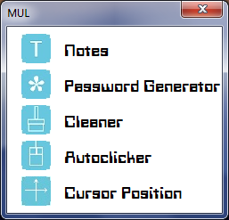

This application is a combination of several tools assembled into one program. This can reduce the time it takes to perform routine processes.More information below.

<h3>Abilities</h3>

&#8195;1.Mini-Notepad

&#8195;&#8195;Here you can write what you want  

&#8195;2.Cleaner

&#8195;&#8195;The cleaner will clear all unnecessary files

&#8195;3.Password Generator
  
&#8195;&#8195;Generate different passwords 

&#8195;4.Autoclicker
  
&#8195;&#8195;Automatically clicks the mouse 

&#8195;5.Get cursor position
  
&#8195;&#8195;Getting cursor position
<h3>How to start?</h3>

&#8195;1.Open MUL.exe as administrator

&#8195;2.Create file with name dairy.txt

<h3>Version</h3>

&#8195;0.3.0

<h3>Platform</h3>

&#8195;OS Windows

<h3>Screenshot</h3>

